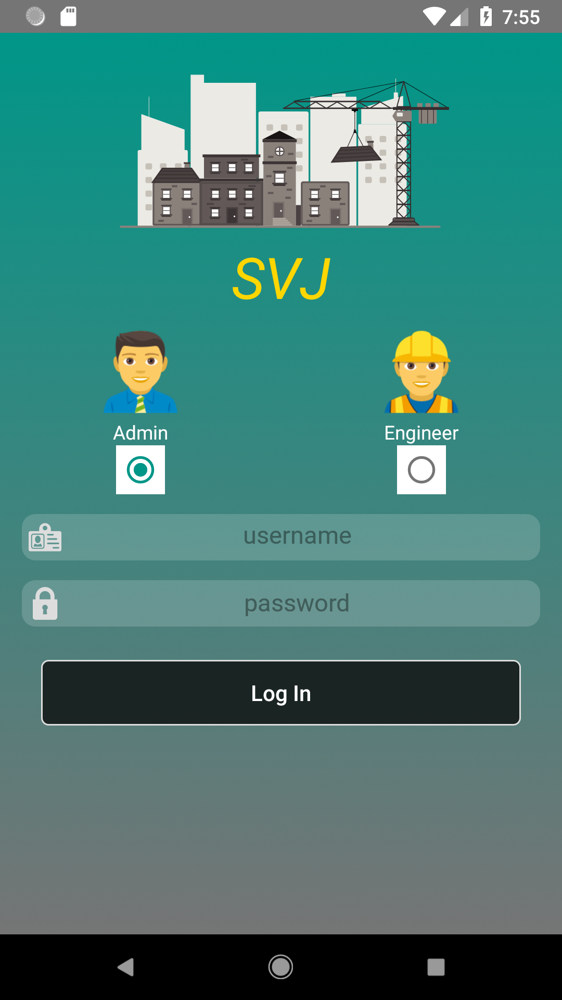
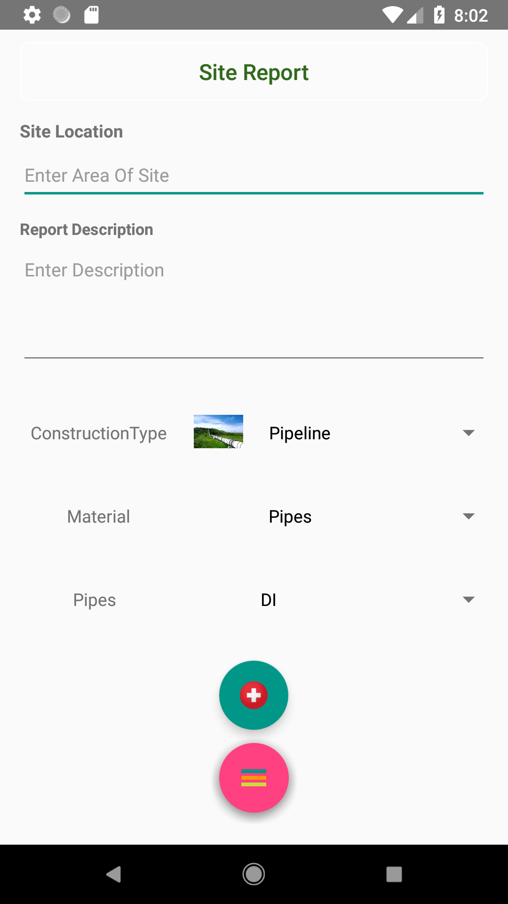
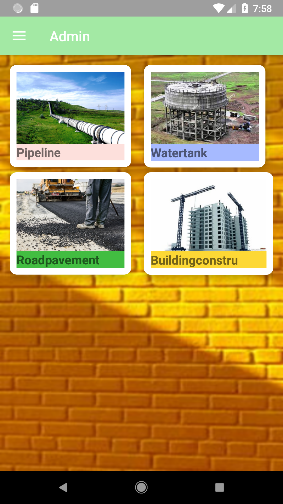
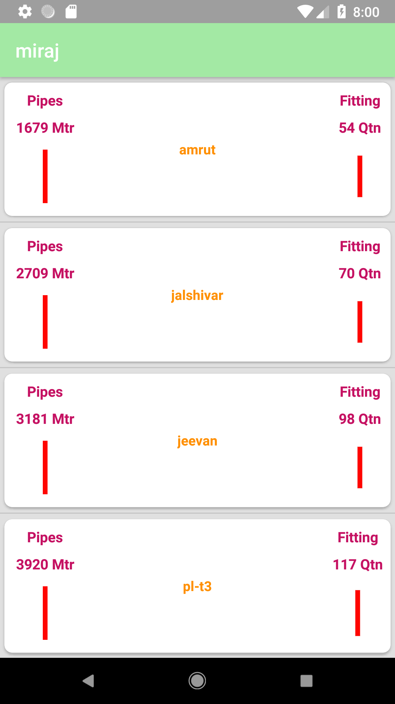

# S.V.Jadhav Contractors!

This app provides functionalities like **site inspection**, **equipment location**, **Godown Inventory management** etc.

Login Page   |  Admin Function |  Report Creation   |  Landing Page   | Site Total
:-------------------------:|:-------------------------: | :-------------------------: |:-------------------------: |:-------------------------: |
  | |  |  | 

## The Administrator will be able  
- to create a new construction site like Pipeline, Road Pavement, Watertank (ESR or GSR) or Building Construction and assign Engineers specific to that site,  
- to add new members like (another admin or engineer) or delete existing engineer,  
- to locate JCB, Tractor, concrete mixers and more...  
- to see the daily reports created by specific engineer regarding a specific site and could estimate how the construction is moving forward,  
- to convey his thought if some work needs to have happened urgently,  
- to send the requirement requested by Engineers in no time,  
- to take a glance at Material used at the specific site since it's inception.

## An engineer can update 
1) Manpower used that particular day,  
2) Equipment Reading,  
3) Any requirement that must be conveyed to admin.

[Checkout on an Android playstore](https://play.google.com/store/apps/details?id=com.svjadhavcontractors&hl=en "	
S.V.JADHAV CONTRACTORS")